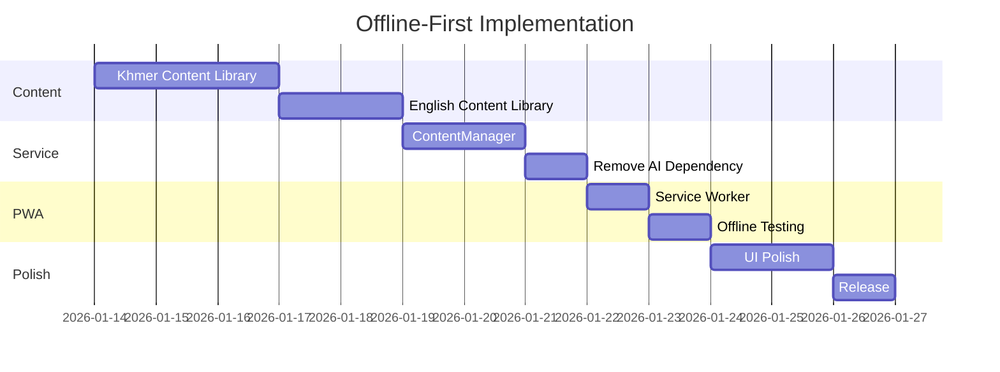

# KOOMPI TYPING: AI-Independent Architecture Plan

## Executive Summary

This document outlines the plan to make KOOMPI TYPING work **completely independently from AI services** while maintaining the option to enhance the experience with AI when available. The app will be **offline-first** with optional online features.

---

## Current Architecture

```
┌─────────────────────────────────────────────┐
│                  User                       │
└─────────────────────────────────────────────┘
                      │
                      ▼
┌─────────────────────────────────────────────┐
│            React Frontend                   │
│  ┌─────────────────────────────────────┐    │
│  │  geminiService.ts                   │────┼──► Gemini API (REQUIRED)
│  │  - generatePracticeText()           │    │
│  └─────────────────────────────────────┘    │
└─────────────────────────────────────────────┘
```

**Problem:** App currently depends on Gemini API for text generation, falling back to limited offline content only when API fails.

---

## Target Architecture (Offline-First)

```
┌─────────────────────────────────────────────┐
│                  User                       │
└─────────────────────────────────────────────┘
                      │
                      ▼
┌─────────────────────────────────────────────┐
│            React Frontend (PWA)             │
│  ┌─────────────────────────────────────┐    │
│  │  ContentService                     │    │
│  │  ├── offlineContent.ts (PRIMARY)    │    │
│  │  ├── aiContent.ts (OPTIONAL)   ─────┼────┼──► Gemini API
│  │  └── contentManager.ts              │    │
│  └─────────────────────────────────────┘    │
│                                             │
│  ┌─────────────────────────────────────┐    │
│  │  Service Worker                     │    │
│  │  - Cache all assets                 │    │
│  │  - Enable offline mode              │    │
│  └─────────────────────────────────────┘    │
└─────────────────────────────────────────────┘
```

---

## Implementation Tasks

### Phase 1: Expand Offline Content (Priority: HIGH)

#### 1.1 Create Comprehensive Khmer Content Library

**File:** `utils/khmerContent.ts`

```typescript
export const KHMER_CONTENT = {
  // Level 1-10: Basic Consonants
  consonants: {
    level1: ["ក ខ គ ឃ ង", "ច ឆ ជ ឈ ញ"],
    level2: ["ដ ឋ ឌ ឍ ណ", "ត ថ ទ ធ ន"],
    // ... more levels
  },
  
  // Level 11-30: Vowels with Consonants
  vowels: {
    level11: ["កា កិ កី កុ កូ", "ខា ខិ ខី ខុ ខូ"],
    // ... more levels
  },
  
  // Level 31-60: Common Words
  words: {
    greetings: ["សួស្តី", "អរុណសួស្តី", "សាយ័ណ្ហសួស្តី"],
    family: ["ម៉ាក់", "ប៉ា", "បង", "ប្អូន", "យាយ", "តា"],
    numbers: ["មួយ", "ពីរ", "បី", "បួន", "ប្រាំ"],
    // ... 500+ words organized by category
  },
  
  // Level 61-100: Sentences
  sentences: {
    daily: [
      "ខ្ញុំទៅសាលារៀនរាល់ថ្ងៃ។",
      "ម៉ាក់ខ្ញុំធ្វើម្ហូបឆ្ងាញ់ណាស់។",
      // ... 200+ sentences
    ],
    proverbs: [
      "ទឹកជ្រៅកុំនាំគេផឹក។",
      "ចេះអត់ធ្មត់មានដី។",
      // ... Khmer proverbs
    ],
  },
  
  // Level 101-150: Paragraphs
  paragraphs: {
    culture: ["..."],
    history: ["..."],
    nature: ["..."],
  }
};
```

#### 1.2 Create English Content Library

**File:** `utils/englishContent.ts`

```typescript
export const ENGLISH_CONTENT = {
  // Similar structure with 500+ words, 200+ sentences, 50+ paragraphs
  homeRow: ["asdf jkl;", "fjdk sla;"],
  topRow: ["qwer uiop", "tyui wert"],
  // ... comprehensive content
};
```

### Phase 2: Content Management Service

#### 2.1 Create ContentManager

**File:** `services/contentManager.ts`

```typescript
export class ContentManager {
  private aiEnabled: boolean;
  private offlineContent: ContentLibrary;
  
  constructor() {
    this.aiEnabled = this.checkAIAvailability();
    this.offlineContent = this.loadOfflineContent();
  }
  
  /**
   * Get practice text - tries AI first if enabled, falls back to offline
   */
  async getPracticeText(options: {
    lang: Language;
    level: number;
    difficulty: Difficulty;
  }): Promise<string> {
    // Always try offline first for speed
    const offlineText = this.getOfflineText(options);
    
    // If AI is enabled and online, enhance with AI in background
    if (this.aiEnabled && navigator.onLine) {
      this.prefetchAIContent(options).catch(() => {});
    }
    
    return offlineText;
  }
  
  /**
   * Get level-specific content from offline library
   */
  private getOfflineText(options): string {
    const library = options.lang === 'km' ? KHMER_CONTENT : ENGLISH_CONTENT;
    return this.selectContent(library, options.level, options.difficulty);
  }
}
```

### Phase 3: Service Worker for PWA

#### 3.1 Create Service Worker

**File:** `public/sw.js`

```javascript
const CACHE_NAME = 'koompi-typing-v1';
const ASSETS = [
  '/',
  '/index.html',
  '/assets/index.js',
  '/assets/index.css',
  '/manifest.json',
  '/icons/icon-192.png',
  '/icons/icon-512.png',
];

// Cache on install
self.addEventListener('install', (event) => {
  event.waitUntil(
    caches.open(CACHE_NAME).then((cache) => cache.addAll(ASSETS))
  );
});

// Serve from cache, fallback to network
self.addEventListener('fetch', (event) => {
  event.respondWith(
    caches.match(event.request).then((response) => {
      return response || fetch(event.request);
    })
  );
});
```

#### 3.2 Register Service Worker

**File:** `index.tsx` (add)

```typescript
if ('serviceWorker' in navigator) {
  navigator.serviceWorker.register('/sw.js');
}
```

### Phase 4: Optional AI Enhancement

#### 4.1 AI Service (Optional)

**File:** `services/aiService.ts`

```typescript
export class AIService {
  private enabled: boolean;
  
  constructor() {
    // Only enable if API key exists
    this.enabled = !!import.meta.env.VITE_GEMINI_API_KEY;
  }
  
  isEnabled(): boolean {
    return this.enabled && navigator.onLine;
  }
  
  /**
   * Generate personalized content based on user's weak areas
   */
  async generatePersonalizedContent(userStats: UserStats): Promise<string | null> {
    if (!this.isEnabled()) return null;
    
    // Analyze user's mistakes and generate targeted practice
    // ...
  }
}
```

---

## Content Requirements

### Khmer Content (Minimum)

| Category | Count | Examples |
|----------|-------|----------|
| Consonants | 33 | ក ខ គ ឃ ង ... |
| Vowels | 23 | ា ិ ី ឹ ឺ ... |
| Subscripts | 33 | ្ក ្ខ ្គ ... |
| Common Words | 500+ | Organized by topic |
| Sentences | 200+ | Daily, formal, proverbs |
| Paragraphs | 50+ | Culture, history, nature |

### English Content (Minimum)

| Category | Count | Examples |
|----------|-------|----------|
| Home Row | 20 drills | asdf jkl; ... |
| All Keys | 50 drills | The quick brown fox ... |
| Common Words | 1000+ | Organized by frequency |
| Sentences | 300+ | Various topics |
| Paragraphs | 100+ | Technology, nature, etc. |

---

## Implementation Timeline



---

## File Changes Summary

| File | Action | Description |
|------|--------|-------------|
| `utils/khmerContent.ts` | NEW | 500+ words, 200+ sentences |
| `utils/englishContent.ts` | NEW | 1000+ words, 300+ sentences |
| `services/contentManager.ts` | NEW | Unified content access |
| `services/geminiService.ts` | MODIFY | Make optional |
| `public/sw.js` | NEW | Service worker |
| `index.tsx` | MODIFY | Register SW |

---

## Success Criteria

- [ ] App loads and works with no internet connection
- [ ] All 150 levels have offline content
- [ ] Khmer input works on Linux (IBus), Windows, macOS
- [ ] PWA installable on all platforms
- [ ] AI features gracefully disabled when offline
- [ ] Bundle size < 500KB (excluding fonts)
